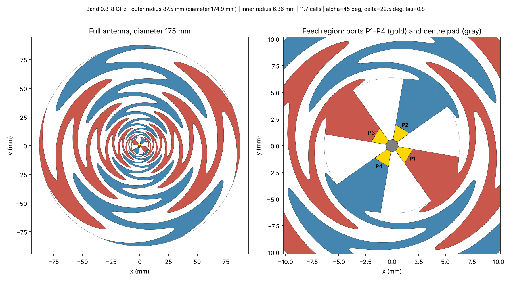

# Sinuous ultra-wideband antenna (0.8–8 GHz)

A 4-arm sinuous antenna built from the standard design equations, simulated in Ansys HFSS through PyAEDT.

| File | What it does | Needs Ansys? |
|---|---|---|
| `run_sinuous.py` | Builds the HFSS model, solves, exports everything, makes the plots | Yes |
| `sinuous_geometry.py` | The antenna shape (design equations). `python sinuous_geometry.py` makes `sinuous_preview.png` | No |
| `rf_post.py` | Plots + `summary.md` from saved data. `python rf_post.py results/<run>` | No |

## Run it (in this order)

At the top of `run_sinuous.py`, set `MODE`:

1. **`"geometry"`**: builds the model and stops (about 1 minute). Look at it in the HFSS window. Nothing is solved.
2. **`"smoke"`**: coarse solve. The fastest real results, and it checks that the whole pipeline works.
3. **`"full"`**: accurate solve for the report. Slow, so start it and come back later.

Every run makes its own folder `results/<date>_<mode>/`. **Open `summary.md` there first**: it has the key numbers and all the plots on one page, ready for the weekly report. The HFSS project (`sinuous.aedt`) is in the same folder.

If a run stops with an error, the full message is in `log.txt` in that run folder.

## Default design

| Setting | Value | Why |
|---|---|---|
| Band | 0.8–8 GHz | Change `F_LOW_GHZ` / `F_HIGH_GHZ`. 0.5 GHz makes the antenna ~280 mm wide |
| Diameter | ~175 mm | Set automatically from `F_LOW_GHZ` |
| Arms | 4, alpha = 45°, delta = 22.5°, tau = 0.8 | Classic self-complementary sinuous |
| Substrate | Rogers RO4003C, 0.813 mm (32 mil) | Low loss, stable, cheapest common Rogers laminate, standard PCB process |
| Feed | 4 lumped ports at the centre, 66.5 Ω each | Pairs give 133 Ω differential, the natural impedance of this antenna |

## What the results mean

- **Return loss (Sdd11)**: below −10 dB means at least 90% of the power goes into the antenna.
- **Isolation (Sdd21)**: leakage between the two polarizations. Below −20 dB is good.
- **Impedance / Smith chart**: should stay close to 133 Ω with little reactance.
- **Patterns**: two lobes (up and down) because there is **no cavity yet**.
- **Axial ratio**: below 3 dB means the circular mode really is circular.
- **Surface current (in HFSS)**: in the project tree, *Field Overlays → Jsurf_1GHz* (also 2 and 4 GHz). Right-click → *Animate* to see the active region; lower frequency means a larger ring.

## Next stages

1. ~~Arms + ideal feed~~ (this script)
2. Metal cavity + absorber behind the arms (one-sided pattern)
3. Klopfenstein microstrip balun, 50 Ω → 133 Ω, simulated on its own
4. Full assembly
